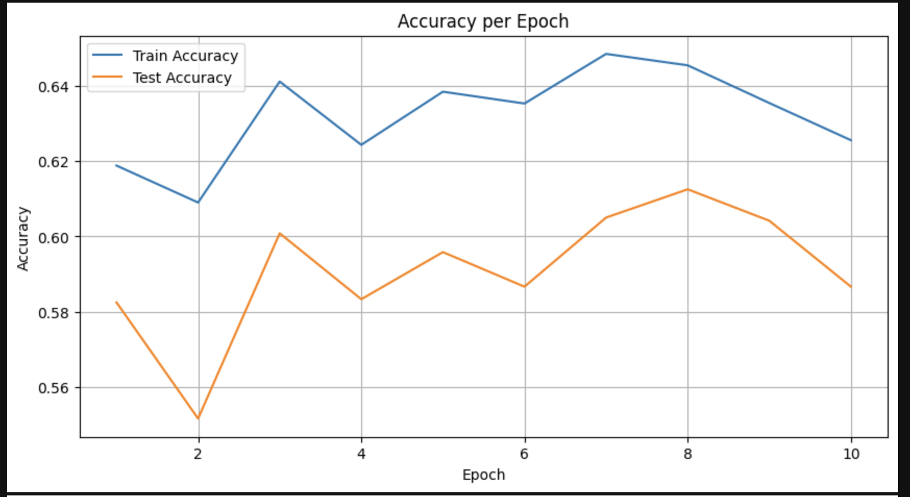
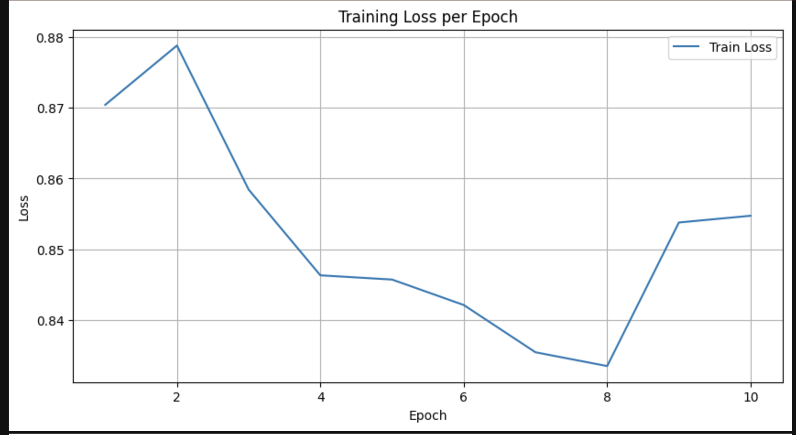
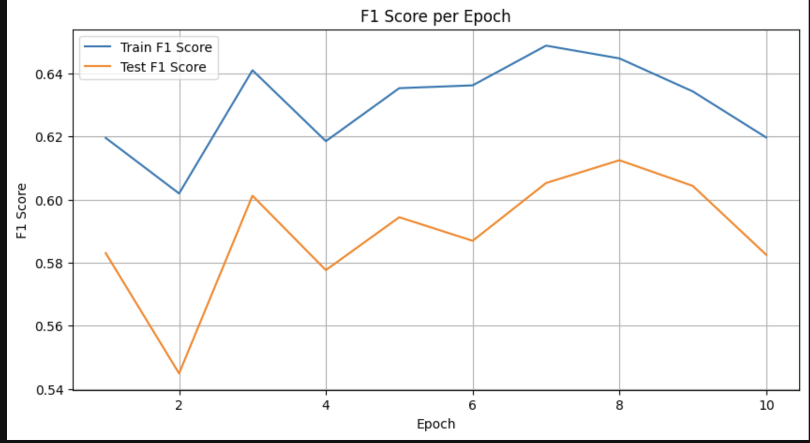

## 심화과제 링크 
[과제파일로_가기](./2_distil_bert_advenced.ipynb)

## Q1) 어떤 task를 선택하셨나요?
> Multi-Genre Natural Language Inference (MNLI) 태스크를 선택

## Q2) 모델은 어떻게 설계하셨나요? 설계한 모델의 입력과 출력 형태가 어떻게 되나요?
> 모델은 DistilBERT 사전 학습 모델을 기반으로, 마지막에 분류기를 추가하여 입력된 문장 쌍의 관계를 세 가지 레이블(Entailment, Contradiction, Neutral)로 분류하는 구조입니다.
> 입력에 Premise와 Hypothesis 문장을 토큰화를 위해 collate_fn 에서 최대 lenght를 128로 설정하였습니다
> 클래스 분류 문제이기 때문에 최종적으로 3개의 분류 값을 출력하게 됩니다. 

## Q3) 어떤 pre-trained 모델을 활용하셨나요?
> torch.hub.load를 통해 PyTorch의 DistilBERT 모델을 불러왔습니다.

## Q4) 실제로 pre-trained 모델을 fine-tuning했을 때 loss curve은 어떻게 그려지나요? 그리고 pre-train 하지 않은 Transformer를 학습했을 때와 어떤 차이가 있나요? 
모델을 설계시 처음 pre-train 된 모델에서 클래스 분류 부분만 학습을 가중치 업데이트를 했지만 실제 Train-loss가 줄어들지 않았습니다.    
이를 해결 하기 위해 마지막 레이어 2개를 학습 시키기로 결정하였고 Train-loss가 점차적으로 줄어드는 것을 확인했습니다.    
pre-trained 되지 않은 모델은 실제 학습 시간이 너무 올래 걸리는 문제가 있습니다.    
또한 적은 데이터로 학습을 시켜야하는 경우 pre-trained 되지 않은 모델의 경우 정확성이 약 30% 정도에 수렴했습니다.    

## Metrix

