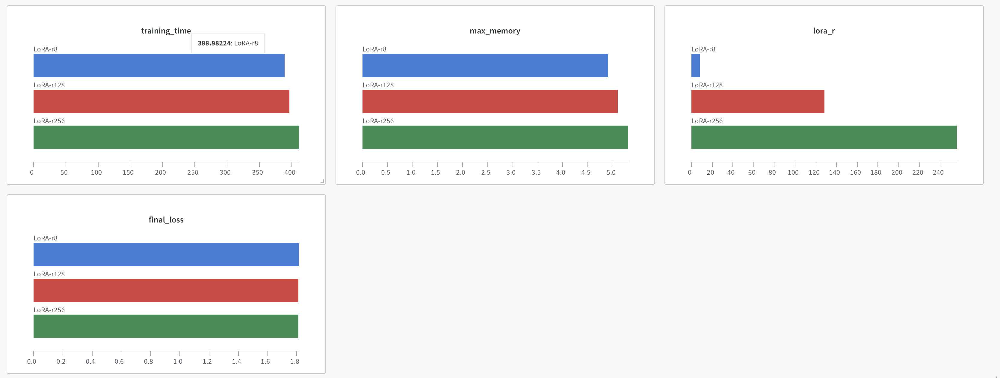

# Lora 기본과제를 진행하면서 

- Lora를 사용함으로써 큰 LLM 모델을 파인튜닝하는데 많은 GPU를 사용하지 않고 학습할 수 있다는 것을 이해했습니다. 
- Lora_RANK 값을 증가시킬수록 메모리를 많이 사용함을 볼 수 있었습니다. 
- Lora의 RANK 값이 작을 수록 loss가 상대적으로 줄어들기를 원했지만 step의 수를 적게 설정해서 그런지 유의미한 결과를 도출하지 못했습니다.(시간부족으로 max_step을 제한했습니다.)
- 가장 유의미한 결과 중 하나는 **grad_norm** 매트릭을 비교시 rank 값이 클수록 안정적으로 학습을 한다는 것을 이해했습니다.

  
<b>LoRa-8</b>

  

    <ul>
        
    </ul>
  

  
<b>LoRa-128</b>

  

    <ul>
        
    </ul>
  

  
<b>LoRa-256</b>

  

    <ul>
        
    </ul>
  

## LoRA의 장점과 단점

### LoRA의 장점
- 작은 Rank에서도 충분한 성능을 제공 
- 메모리 효율적
- 학습 속도 빠름

### LoRA의 단점
- Rank가 너무 작으면 학습이 느려질 수 있음
- Rank가 너무 크면 Overfitting 위험과 과도한 메모리 사용
- `r=256`은 메모리 사용량 증가, 학습 시간이 길어지는 단점이 존재

# WANDB 이미지 

## 학습 매트릭

## 서버 점유율 및 실행시간 매트릭

